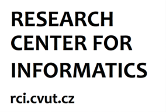

# VISHAC - Efficient Visuo-Haptic Object Shape Completion for Robot Manipulation

This repository includes code for *Efficient Visuo-Haptic Object Shape Completion for Robot Manipulation* paper.

**Authors**: Lukas Rustler, Jiri Matas, and Matej Hoffmann
**Maintainer**: Lukas Rustler, lukas.rustler@fel.cvut.cz

 

# Contents

 - [Licensing](#licensing)
 - [Installation](#installation)
 - [Data](#data)
 - [Run](#run)
 - [Real Setup](#real-setup)
 - [Publication / citing](#publication)
 - [Acknowledgements](#acknowledgements)

## Licensing
The code created in this work is under GNU-3 licence.
For licensing information about otherused repositories see: 
[LICENSE](LICENSE), and the original repositories:  

- [ODIO-URDF](https://github.com/hauptmech/odio_urdf)    
- [MuJoCo-ROS](https://github.com/JKBehrens/mujoco-ros)  
- [Kinova_Mujoco](https://github.com/JKBehrens/kinova_mujoco)  
- [V-HACD](https://github.com/kmammou/v-hacd)
- [IGR](https://github.com/amosgropp/IGR)
- [ros_kortex](https://github.com/Kinovarobotics/ros_kortex)   
- [YOLOv7](https://github.com/WongKinYiu/yolov7)  
- [orocos](https://github.com/orocos/orocos_kinematics_dynamics)

MuJoCo is a trademark of DeepMind (https://mujoco.org)

## Installation
The code is tested on Ubuntu 20.04 with ROS Noetic. 
It will run only on unix-based systems, i.e., it will not work
in windows.

There are two options to install/use the code: 
**1) Docker** (recommended) and **2) manual installation**. 

### Docker  

The image is available at: [Docker hub](https://hub.docker.com/repository/docker/rustlluk/vishac/general)  

**Steps to use**:  

 1. Install Docker from https://docs.docker.com/engine/install/  
 2. Install nvidia-docker from https://docs.nvidia.com/datacenter/cloud-native/container-toolkit/install-guide.html#docker  
    - for GPU
 3. Create a new folder (e.g., VISHAC), clone this repository, and
     rename the downloaded folder to VISHAC

        cd some_path/VISHAC
        git clone https://github.com/ctu-vras/vishac.git
        mv vishac src

 4. Use the provided script [run.sh](Docker/run.sh) with `xhost local:root`
    - the script takes 2 mandatory parameters:
       - name of the container
         - string
         - recommended: vishac
       - path to link inside the container
         - string
         - should be: `some_path/VISHAC` from the previous step
    - optional parameter 'cpu' can be use to run the container in CPU
      only mode 
    - *e.g.*, `xhost local:root && ./run.sh vishac /home/my_user/VISHAC`
      -  If you run it non-linux enviroment, running over SSH or it doesnt work, run: `vnc && start-vnc-server.sh` inside the docker container.  This will open VNC server inside the container,
         and you can access it through your browser at: `http://ip_address:6080`. Where ip_address is `localhost` if you run it on local machine, or ip address of a remote machine.

 5. Now, when you are in the docker environment, build the workspace:
  
        cd some_path/VISHAC
        source /opt/ros/noetic/setup.bash
        catkin init
        catkin build
        source devel/setup.bash

### Manual installation

Manual installation is also possible. Ubuntu 20.04 is recommended.
Install ROS Noetic, Python 3 with all dependencies 
(mainly cv2, trimesh, open3d, numpy, pytorch;
see [Dockerfile](Docker/Dockerfile) for more information). 
The build instructions are the same as for Docker.

## Data

Data are available at [OSF.io platform](https://osf.io/j6rkd/).  

- To run new experiments or repeat, you only need to download [GT_meshes]()
and extract them to [kinova_mujoco/GT_meshes](kinova_mujoco/GT_meshes).

- If you want to use data collected during our experiments,
  [meshes](https://osf.io/j6rkd/files/osfstorage/64087dae86049004c308738c), [point clouds](https://osf.io/j6rkd/files/osfstorage/64085b29c74723049d10b1e4),
  [logs](https://osf.io/j6rkd/files/osfstorage/64085a80e25636048e231f17), [rosbags](https://osf.io/j6rkd/files/osfstorage/640869b0e256360497231d26), [metrics]([https://osf.io/j6rkd/files/osfstorage/64085a82c7472304a010aed7](https://osf.io/j6rkd/files/osfstorage/6408a98086049004ed08693e))
  and [numpy files](https://osf.io/j6rkd/files/osfstorage/64085b9d86049004a1086f3e) are available to download as well. Also,
  experiments files used are available in [exps](shape_completion/data/exps)
  directory.

When running the pipeline, all data will be stored at: 
`some_path/VISHAC/src/shape_completion/data`. Completed meshes, 
collected point clouds, corresponding numpy files and rosbags are saved
after every touch. In addition, after using evaluation scripts
(see below) Python Pickle files will be created.

## Run

The easiest way how to run experiments is to:  

1. prepare experiment file in [exps](shape_completion/data/exps) directory.
See [example.json](shape_completion/data/exps/example.json) 
or [single.json](shape_completion/data/exps/single.json) files.
   - The json file should include:
     - objects: [["object name 1", ..., "object name n"], [...]]
       - object names are taken from names of the objects
         in [GT_meshes](kinova_mujoco/GT_meshes). Without file extension.
       - each element can contain up to 5 objects
       - each sub list is one experiment
     - origins: [[origin 1, ..., origin n], [...]]
        - origins are in the form of list [x, y, z]
        - one origin for each object
     - repetitions: [int, ...]
       - number of repetitions for given experiment
     - reconstructions: [int, ...]
       - number of touches in given experiment
     - max_time: [float, ...]
       - max time for each experiment
2. run `rosrun shape_completion do_experiments.py -s some_path/VISHAC/src/shape_completion/data/exps/your_experiment.log`
   - this will run the experiment defined in your exp file
   - the results will be written in [log directory](shape_completion/data/logs)
   - in the end, evaluation script is run to compute Jaccard similarity and Chamfer distance

If you want to run everything by yourself:
 - Run the simulation `run_simulation object_name_1,...,object_name_n
   [[origin 1,...,origin_n]] 'false' 'true' 'true' 
   FPS free_space number_of_points 0`
   - where:
     - FPS - whether to use Farthest Point Sampling, true or false
     - free_space - whether to use free space, true or false
     - number_of_points - how many point to use in each IGR iteration, we used 500
   - run_simulation is alias for [run_simulation.sh](shape_completion/scripts/run_simulation.sh).
     - if you use docker, the alias should already exist
 - run the main script `rosrun shape_completion main.py -r number_of_reconstruction
   -t max_time`
   - where:
     - number_of_reconstruction - number of touches + 1
     - max_time - desired maximum running time of the pipeline
 - If you want to evaluate the results, run `rosrun shape_completion evaluation_utils.py 
   name_of_log_file`
   - where name_of_log_file is name of log created with main.py saved in
     [logs](shape_completion/data/logs) directory.
 

## Real Setup

This repository does not include drivers for the real-world devices.
However, the code is unchanged and can be used with real
robot. The code contains parameter _real_setup_, 
which control behaviour of some functions. 

You can get inspired from
[real.launch](shape_completion/launch/real.launch),
that was used for real experiments with Kinova Gen3, with
Robotiq 2F-85 gripper and Intel D435 camera.

## Publication
This repository is connected to the following publication:

Rustler, L., Matas, J., & Hoffmann, M. (2023). 'Efficient Visuo-Haptic Object Shape Completion for Robot Manipulation
'. In Intelligent Robots and Systems (IROS), IEEE/RSJ International Conference on. [[DOI]](https://doi.org/10.48550/ARXIV.2303.04700)

If you use the code or data in this repository, please cite this article.

## Video
A video accompanying the article is availabe on [[youtube]](https://youtu.be/V5mNKDACetA).

## Acknowledgements
This work was supported by the OP VVV MEYS funded project
CZ.02.1.01/0.0/0.0/16 019/0000765 “Research Center for Informatics”.
L.R. was additionally supported by the Czech Technical University
in Prague, grant no. SGS22/111/OHK3/2T/13. 

 
 

We also thank to authors of [Act-VH](https://github.com/ctu-vras/visuo-haptic-shape-completion).
Last but not least, we thank [Robotology community](https://github.com/robotology) for help the with Docker image.
